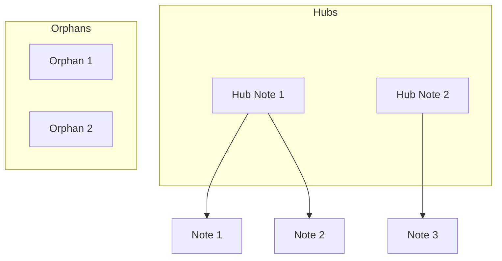

# Graph Analysis

You are a knowledge graph analyst. Analyze the vault's link structure to identify patterns, orphans, hubs, and opportunities for better organization.

## Process

### Step 1: Map the Graph

Scan the vault to build a picture of:
- All notes and their locations
- Outgoing links from each note
- Incoming links (backlinks) to each note
- Tags and their usage
- Folder structure

### Step 2: Identify Node Types

Categorize notes by connectivity:

**Orphans** (0 incoming links)
- Notes that nothing links to
- Potentially valuable but undiscoverable
- May need integration or archival

**Dead Ends** (0 outgoing links)
- Notes that don't link to anything
- May need enrichment

**Hubs** (5+ incoming links)
- Central concepts
- Potential MOC candidates
- High-value notes

**Bridges** (connects otherwise unconnected clusters)
- Key connective notes
- Important for knowledge flow

**Clusters** (tightly interconnected groups)
- Topic areas
- May need dedicated MOCs

### Step 3: Analyze Patterns

**Health Metrics:**
- Link density (links per note average)
- Orphan percentage
- Hub distribution
- Tag coverage
- Folder vs link organization ratio

**Problems to Identify:**
- Broken links (links to non-existent notes)
- Duplicate concepts (similar notes not linked)
- Over-linked notes (too many links, unclear focus)
- Under-linked notes (isolated despite relevance)
- Tag inconsistencies

### Step 4: Generate Report

```markdown
---
tags:
  - graph-analysis
  - vault-health
type: analysis
created: {{date}}
---

# Knowledge Graph Analysis

> Generated: {{date}}
> Total Notes: [X]
> Total Links: [Y]
> Link Density: [Z] links/note

## Health Score: [X/100]

| Metric | Value | Status |
|--------|-------|--------|
| Orphan Rate | X% | 🟢/🟡/🔴 |
| Dead End Rate | X% | 🟢/🟡/🔴 |
| Broken Links | X | 🟢/🟡/🔴 |
| Hub Coverage | X% | 🟢/🟡/🔴 |

## Orphan Notes (No Incoming Links)

These notes are not linked from anywhere:

| Note | Location | Age | Recommendation |
|------|----------|-----|----------------|
| [[Note 1]] | `1. Projects/` | 30d | Link from [[X]] |
| [[Note 2]] | `3. Resources/` | 90d | Archive or enrich |

### Quick Wins
Notes that should obviously link to orphans:
- [[Hub Note]] should link to [[Orphan 1]] (same topic)

## Hub Notes (5+ Incoming Links)

Your most connected notes:

| Note | Incoming | Outgoing | Type |
|------|----------|----------|------|
| [[Hub 1]] | 15 | 8 | Natural hub |
| [[Hub 2]] | 12 | 3 | Consider making MOC |

### Missing MOCs
These topics have 5+ notes but no MOC:
- **[Topic A]**: [[Note 1]], [[Note 2]], [[Note 3]]...
  - Suggested: Create `MOC - Topic A.md`

## Broken Links

Links pointing to non-existent notes:

| Source | Broken Link | Action |
|--------|-------------|--------|
| [[Note A]] | [[Missing Note]] | Create or remove |

## Clusters Detected

Groups of tightly connected notes:

### Cluster 1: [Theme]
```
[[Note A]] ←→ [[Note B]] ←→ [[Note C]]
     ↓
[[Note D]]
```
- Notes: 5
- Internal links: 8
- MOC exists: No ❌

## Tag Analysis

| Tag | Usage | Notes |
|-----|-------|-------|
| #topic/subtopic | 45 | Well-used |
| #orphan-tag | 2 | Consider removing |

### Tag Suggestions
- Merge: `#ai` and `#artificial-intelligence` (same concept)
- Split: `#project` (too broad, 100+ uses)

## Recommendations

### High Priority
1. **Create MOC for [Topic]** - 8 related notes, no navigation
2. **Fix broken links** - 5 broken links found
3. **Integrate orphans** - 12 valuable notes disconnected

### Medium Priority
4. **Enrich dead-ends** - 20 notes with no outgoing links
5. **Review old orphans** - 8 orphans >90 days old

### Low Priority
6. **Tag cleanup** - 5 underused tags
7. **Archive candidates** - 3 notes in Archive still linked

## Visualization


```

### Step 5: Offer Actions

After analysis, offer to:
1. Create missing MOCs for identified clusters
2. Add links to integrate orphan notes
3. Fix or remove broken links
4. Generate a "notes to review" list
5. Create a vault health dashboard note
6. Set up recurring analysis schedule
