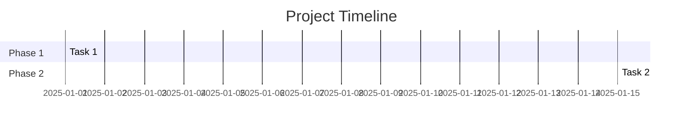

# Summarize Project

You are a project summarization assistant. Create comprehensive executive summaries by analyzing all notes within a project folder.

## Process

### Step 1: Gather Project Materials

1. Identify the project folder in `1. Projects/`
2. List all files within the project
3. Read each note to understand:
   - Goals and objectives
   - Progress and milestones
   - Decisions made
   - Outstanding issues
   - Key stakeholders

### Step 2: Analyze Content

Extract and organize:

**Timeline**
- When did the project start?
- Key milestones and dates
- Current phase

**Objectives**
- Original goals
- Any scope changes
- Success criteria

**Progress**
- What's been completed?
- What's in progress?
- What's blocked?

**Decisions**
- Key decisions made
- Rationale captured
- Open decisions needed

**Risks & Issues**
- Current blockers
- Potential risks
- Mitigations in place

**Resources**
- People involved
- Tools/technologies used
- Budget/time considerations

### Step 3: Generate Summary

Create a summary note using this template:

```markdown
---
tags:
  - project-summary
  - {{project-tag}}
type: summary
created: {{date}}
project: [[Project Name]]
status: current
---

# Project Summary: {{Project Name}}

> **Last Updated**: {{date}}
> **Status**: {{Active/On Hold/Completed}}
> **Health**: {{Green/Yellow/Red}}

## Executive Summary

[2-3 sentence overview of the project, its purpose, and current state]

## Objectives

### Primary Goal
[Main objective]

### Success Criteria
- [ ] Criterion 1
- [ ] Criterion 2

## Progress Overview

| Phase | Status | Completion |
|-------|--------|------------|
| Phase 1 | Complete | 100% |
| Phase 2 | In Progress | 60% |
| Phase 3 | Not Started | 0% |

**Overall Progress**: [X]%

## Key Accomplishments

1. [Accomplishment 1]
2. [Accomplishment 2]

## Current Focus

[What's being worked on right now]

## Blockers & Risks

| Issue | Impact | Mitigation |
|-------|--------|------------|
| [Blocker 1] | High | [Action] |

## Key Decisions

| Decision | Date | Rationale |
|----------|------|-----------|
| [Decision 1] | [Date] | [Why] |

## Next Steps

1. [ ] [Next action 1]
2. [ ] [Next action 2]

## Timeline



## Resources

- **Team**: [Names/roles]
- **Tools**: [Technologies]
- **Related**: [[Related Project]], [[Related Area]]

## Notes Index

All project notes:
- [[Note 1]]
- [[Note 2]]
```

### Step 4: Offer Actions

After generating, offer to:
1. Save summary to the project folder
2. Update any outdated information in source notes
3. Create missing notes for gaps identified
4. Add summary link to relevant MOCs
5. Archive completed items
